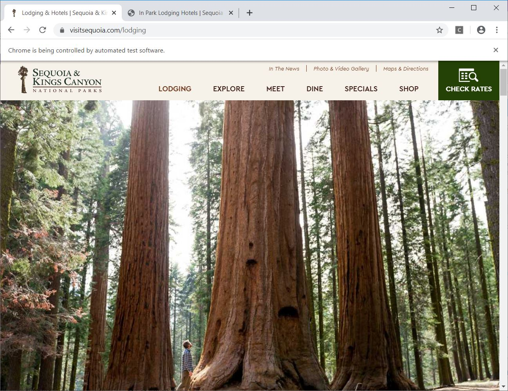
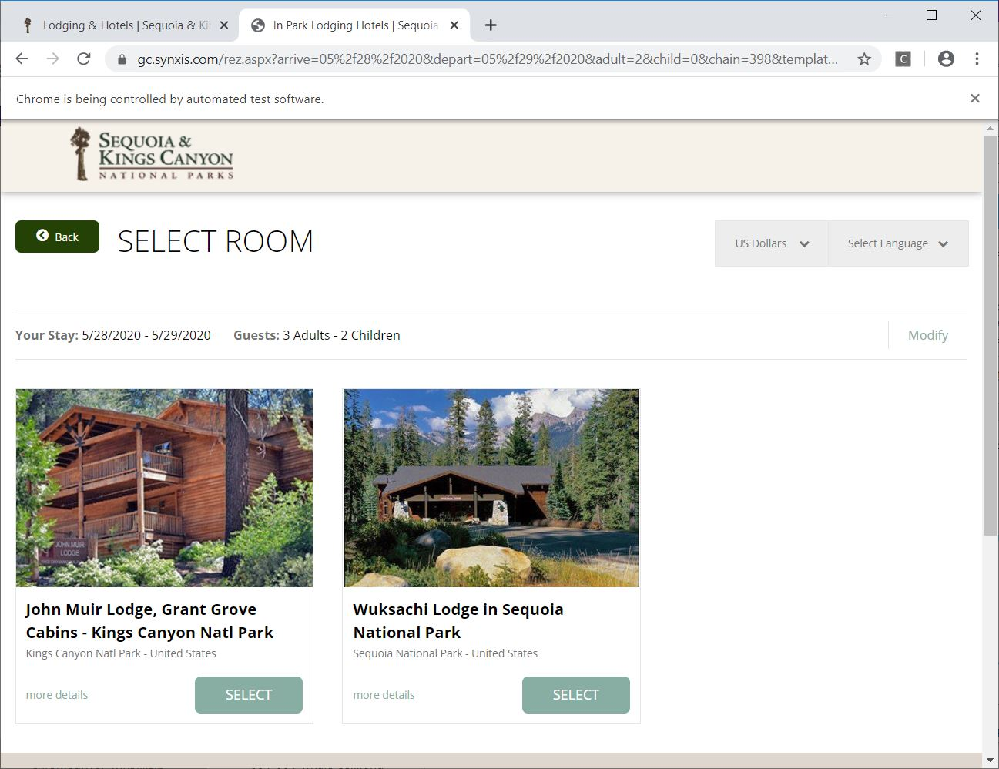

# Kings Canyon National Park Lodging Query
> This project automates the boring searching process using Python, Selenium WebDriver.

## Table of contents
* [General info](#general-info)
* [Screenshots](#screenshots)
* [Technologies](#technologies)
* [Setup](#setup)
* [Features](#features)
* [Status](#status)
* [Contact](#contact)

## General info
National park lodging is so popular such that we need to query so often to check the availability in order to make an reservation. This project automates the querying process. As long as you code in the arrival date, departure date, number of adults, number of kids and the interested lodges, the program will access the web server, fill in the itinerary information and submit the search just like you do it yourself. The search result will appear shortly.

## Screenshots

## Technologies
* Python - version 3.7
* Selenium - version 3.141
* Chrome WebDriver - version 79.0.3945.36

## Setup
Install Windows Anacodna3 Spyder, Selenium package, Chrome WebDriver. Load and run this program.

## Features
To-do list:
* Launch the querying program every certain period of time and email the results if available.

## Status
Project is:  _finished_ and can be enriched by completing the to-do list

## Contact
Created by [@Shelly Li](igloooligm@gmail.com) - feel free to contact me!
